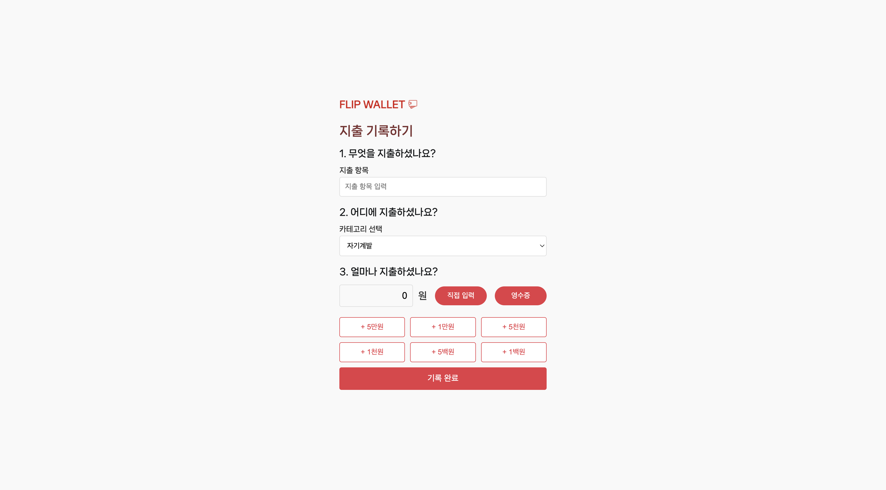
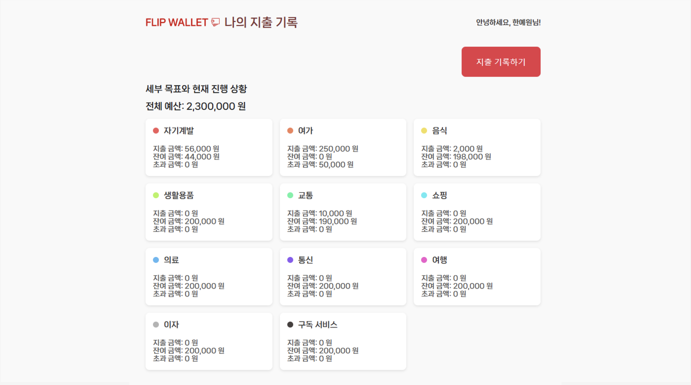

# Flip Wallet - 지출 관리 애플리케이션


## 📌 프로젝트 개요

**Flip Wallet**은 개인의 지출을 관리하기 위해 만든 애플리케이션입니다. 이 프로젝트는 사용자가 손쉽게 자신의 소비 내역을 기록하고 목표 예산에 따라 소비를 관리할 수 있도록 도와줍니다. 영수증 인식을 통한 지출 자동 입력 기능, 예산 관리 및 현재 진행 상황 확인 등의 기능을 제공합니다.

## ✨ 주요 기능

- **회원가입 및 로그인**: 사용자가 자신의 계정을 만들고 로그인할 수 있습니다.
- **지출 기록하기**: 사용자가 직접 지출 항목과 금액을 입력하여 지출을 기록할 수 있습니다.
- **영수증 인식**: 클로바 OCR을 활용하여 영수증 이미지를 인식하고, 항목과 금액을 자동으로 입력합니다.
- **예산 관리**: 사용자가 카테고리별 예산을 설정하고 그에 따른 지출을 관리할 수 있습니다.
- **나의 지출 기록 확인**: 카테고리별 현재 지출 상황과 잔여 예산을 확인할 수 있습니다.

## 🛠️ 기술 스택

- **프론트엔드**: HTML, CSS, JavaScript
  - **스타일링**: CSS를 사용하여 사용자 인터페이스를 깔끔하게 디자인하고, 사용자 친화적인 버튼과 카드 스타일을 구현했습니다.
  - **NanumSquareNeo 폰트**: 깔끔하고 현대적인 타이포그래피로 UI를 꾸몄습니다.

- **백엔드**: FastAPI, SQLAlchemy
  - **데이터베이스**: SQLite를 사용하여 로컬에서 데이터를 관리하고 있습니다.
  - **ORM**: SQLAlchemy를 이용하여 데이터베이스와 상호작용합니다.

- **이미지 인식**: Naver Clova OCR API
  - 영수증 이미지에서 텍스트 정보를 추출하여 지출 항목과 금액을 자동으로 기록합니다.

## 💻 설치 및 실행 방법

아래의 단계에 따라 로컬 환경에서 Flip Wallet을 설치하고 실행할 수 있습니다.

### 1. 저장소 클론
```
git clone https://github.com/jeonkwanghwi/DataBase_flipWallet.git
```
```
cd DataBase_flipWallet
```

### 2. 필요 패키지 설치
```
pip install -r requirements.txt
```

### 3. 환경변수 설정
- 프로젝트 루트에 `.env` 파일을 생성하고, 환경 변수를 설정하세요:
```
receipt_SECRET_KEY=<YOUR_CLOVA_SECRET_KEY>
APIGW_Invoke_URL=<YOUR_CLOVA_API_URL>
```

### 4. 서버 실행
```bash
uvicorn app.main:app --reload
```

### 5. 애플리케이션 접근
- 브라우저에서 [http://127.0.0.1:8000](http://127.0.0.1:8000) 주소로 접속하여 애플리케이션을 사용할 수 있습니다.

## 📋 주요 화면 구성

- **메인 화면**: 사용자 로그인 후 전체 예산과 목표 설정을 관리할 수 있습니다.
- **지출 기록 화면**: 지출 항목과 금액을 입력해 소비 내역을 추가하거나, 영수증을 업로드해 자동 입력할 수 있습니다.
- **나의 지출 기록 확인 화면**: 전체 카테고리별로 예산 대비 사용 금액과 남은 금액을 시각적으로 확인할 수 있습니다.


## 📊 ERD (Entity Relationship Diagram)

아래는 Flip Wallet의 데이터베이스 구조를 보여주는 ERD입니다.


## 📸 스크린샷

**메인 화면**


**영수증 업로드 화면**


**지출 기록 화면**




**세부 목표 설정 화면**


**나의 지출 현황 확인**




Flip Wallet을 통해 자신의 지출을 효율적으로 관리해보세요 💰🚀
